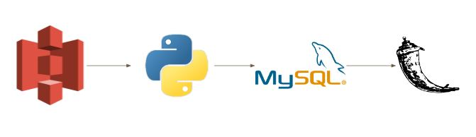
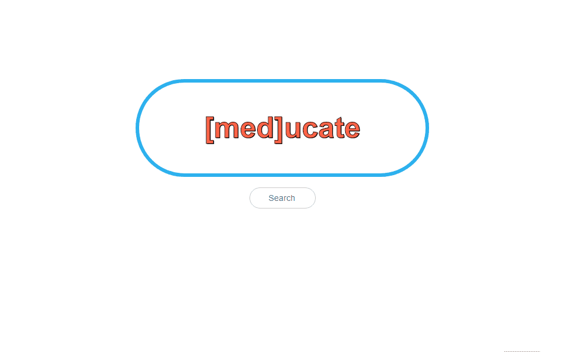

# [med]ucate
Helping you select your meds

## Problem Statement
Most people do not find the medication for their illness on their first try. It usually takes many months of research resulting in multiple visits to the doctors and piling up medical bills.

## Solution
Meducate is a web application that allows users to search for their medical condition and be presented with a graph of the top 5 medications and a table of the other medications used that the user can talk to their doctor about. The data has been preprocessed using MinHash and Jaccard Similarity Index to combine the results of the same medications in different forms.

## Pipeline

The data is a drug review survey conducted by UCI. It reports the drug name, the medical condition it treats, side effects, overall rating of the drug and some comments from the user. 

This data exists in an Amazon S3 bucket and a python script accesses this data and preprocesses the data using MinHash and Jaccard Similarity before saving it in a MySQL database. The Flask application displays the data from the MySQL database to the user after they search for their medical condition. 

## User Interface
Link: [gomeducate.info](gomeducate.info)

